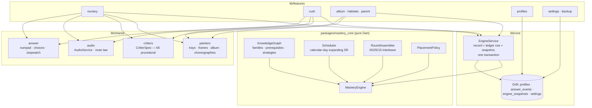

# Architecture overview

## The one seam that matters

`mastery_core` decides **what to ask and when**; the app decides **how it
looks and feels** and owns persistence. The engine is fed `AnswerEvent`s and
snapshots back out — it never touches a database, a widget, or a wall clock
(time arrives as parameters). `EngineService` is the only writer: every
`record()` appends the ledger row and upserts the snapshot in one Drift
transaction, so an interrupted answer can never split state.

## Module rules

- **Painters are pure**: no providers, no streams; all randomness seeded; every
  signature painter is golden-pinned (run `flutter test --tags golden`
  locally and look).
- **Features are vertical**: `data / domain / presentation` inside each
  feature dir; cross-feature reach goes through `lib/core` or `lib/shared`,
  never sideways.
- **Audio is optional by law**: `AudioService` no-ops when muted; every cue
  has a visual twin (ADR-0003).
- **Web** ships the same code; Drift runs on `sqlite3.wasm` +
  `drift_worker.js` (both committed under `web/`).
